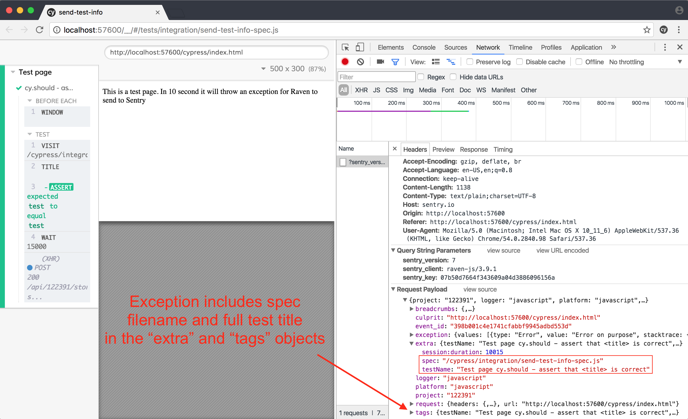
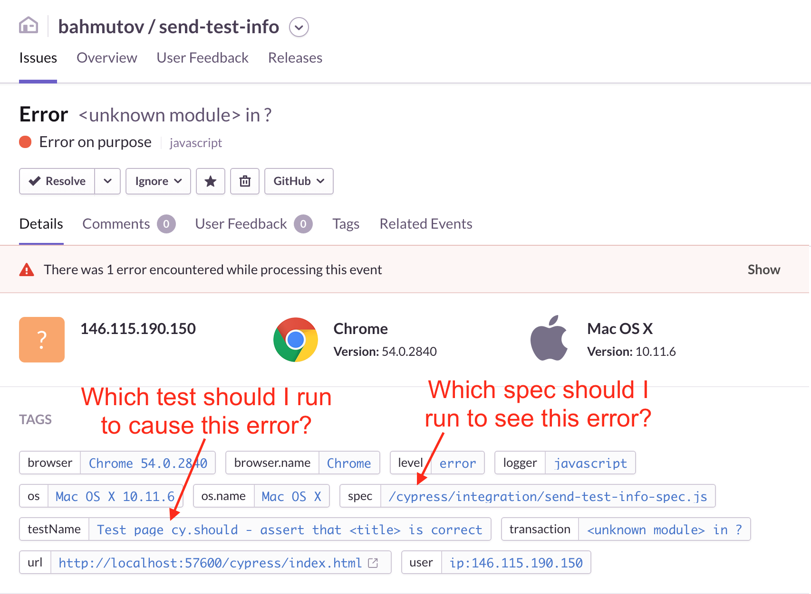

# send-test-info

> Attach unit test information to exceptions sent by Raven to Sentry

[![NPM][npm-icon] ][npm-url]

[![Build status][ci-image] ][ci-url]
[![semantic-release][semantic-image] ][semantic-url]
[![js-standard-style][standard-image]][standard-url]

## Install

Add this module to any project that uses [Cypress](https://www.cypress.io/)
for end to end testing
and [Raven.js client](https://github.com/getsentry/raven-js)
to send exceptions to [Sentry](https://sentry.io/).

```sh
npm i -D send-test-info
```

## Use

From any spec file, require and call a single function with the spec's
filename.

```js
const sendTestInfo = require('../..')
sendTestInfo(__filename)

describe('Test page', function () {
  // unit tests
})
```

See example spec file
[cypress/integration/send-test-info-spec.js](cypress/integration/send-test-info-spec.js)
and the test page [cypress/index.html](cypress/index.html)

## Result

Each exception captured by Raven and sent to Sentry will include the
spec filename and the full test title.



Errors generated during end to end tests can be quickly triaged and recreated
by just looking at the exception tags



### Small print

Author: Gleb Bahmutov &lt;gleb.bahmutov@gmail.com&gt; &copy; 2016

* [@bahmutov](https://twitter.com/bahmutov)
* [glebbahmutov.com](http://glebbahmutov.com)
* [blog](http://glebbahmutov.com/blog)


License: MIT - do anything with the code, but don't blame me if it does not work.

Support: if you find any problems with this module, email / tweet /
[open issue](https://github.com/bahmutov/send-test-info/issues) on Github

## MIT License

Copyright (c) 2016 Gleb Bahmutov &lt;gleb.bahmutov@gmail.com&gt;

Permission is hereby granted, free of charge, to any person
obtaining a copy of this software and associated documentation
files (the "Software"), to deal in the Software without
restriction, including without limitation the rights to use,
copy, modify, merge, publish, distribute, sublicense, and/or sell
copies of the Software, and to permit persons to whom the
Software is furnished to do so, subject to the following
conditions:

The above copyright notice and this permission notice shall be
included in all copies or substantial portions of the Software.

THE SOFTWARE IS PROVIDED "AS IS", WITHOUT WARRANTY OF ANY KIND,
EXPRESS OR IMPLIED, INCLUDING BUT NOT LIMITED TO THE WARRANTIES
OF MERCHANTABILITY, FITNESS FOR A PARTICULAR PURPOSE AND
NONINFRINGEMENT. IN NO EVENT SHALL THE AUTHORS OR COPYRIGHT
HOLDERS BE LIABLE FOR ANY CLAIM, DAMAGES OR OTHER LIABILITY,
WHETHER IN AN ACTION OF CONTRACT, TORT OR OTHERWISE, ARISING
FROM, OUT OF OR IN CONNECTION WITH THE SOFTWARE OR THE USE OR
OTHER DEALINGS IN THE SOFTWARE.

[npm-icon]: https://nodei.co/npm/send-test-info.svg?downloads=true
[npm-url]: https://npmjs.org/package/send-test-info
[ci-image]: https://travis-ci.org/bahmutov/send-test-info.svg?branch=master
[ci-url]: https://travis-ci.org/bahmutov/send-test-info
[semantic-image]: https://img.shields.io/badge/%20%20%F0%9F%93%A6%F0%9F%9A%80-semantic--release-e10079.svg
[semantic-url]: https://github.com/semantic-release/semantic-release
[standard-image]: https://img.shields.io/badge/code%20style-standard-brightgreen.svg
[standard-url]: http://standardjs.com/
